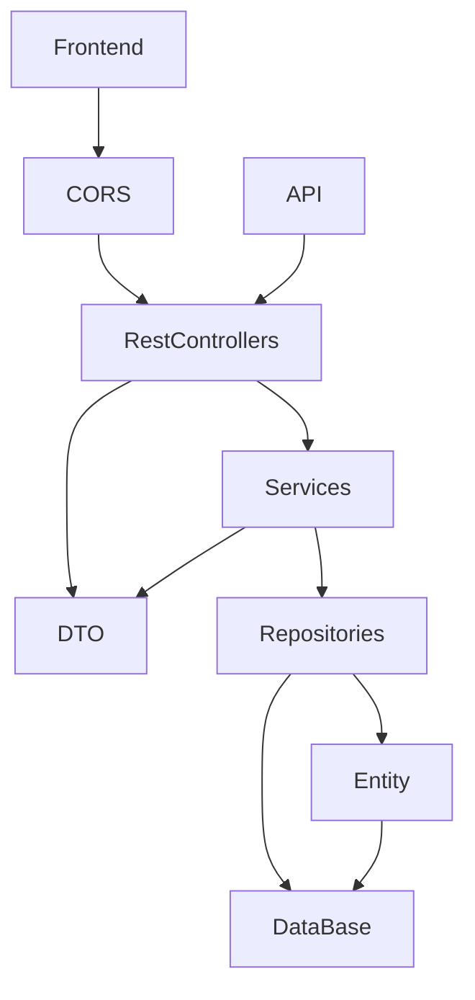

# Aquarium Backend
> The Repo contains backend code of an Aquarium ecommerce web-application

### Architecture Flow
>

```mermaid
graph TD;
    Frontend-->CORS;
    CORS-->RestControllers;
    API-->RestControllers;
    RestControllers-->Services;
    RestControllers-->DTO;
    Services-->Repositories;
    Services-->DTO;
    Repositories-->Entity;
    Repositories-->DataBase;
    Entity-->DataBase;
```

### ER

> 
  
 

### Database Structure

> 
  
 

